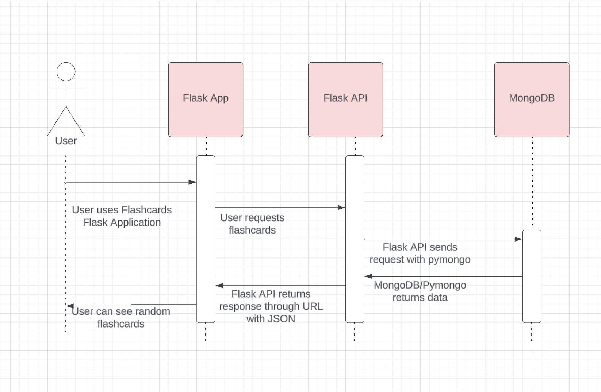

# Flashcards Flask API Microservice
## Communication contract
Group 67
Bryan Wu
Flora Zhang
Ground Rules
1. We will communicate with each other using Discord.
2. Each team member will be expected to respond within 24 hours. 
3. Each team member will be responsible and meet deadlines at least a day before they’re due.
4. Each team member will communicate any potential time conflicts and any blockers.
5. Each team member will communicate if they are confused about anything and have any questions.

## Tech Stack
- Flask
- PyMongo
- MongoDB

## How to request data

In order to request data, the Flask API must be running. To do this, run `python app.py` in the terminal in the folder containing `app.py`. For best results, run `source venv/bin/activate` first, although not required.

The Flask API will now be running at http://127.0.0.1:5002 but can be changed to a different port as needed by changing this line of code `if __name__ == '__main__':
    app.run(debug=True, port=5002) `

Within the application to make the request, a function can be written similar to this `requests.get(http://127.0.0.1:5002/get_data)`. 

## How to receive data

The received data from running `requests.get(http://127.0.0.1:5002/get_data)` is a JSON that the program receiving must parse through. This command can be saved to a variable to more easily work with the resultant data `data = requests.get(http://127.0.0.1:5002/get_data)`. 

## UML Sequence Diagram
